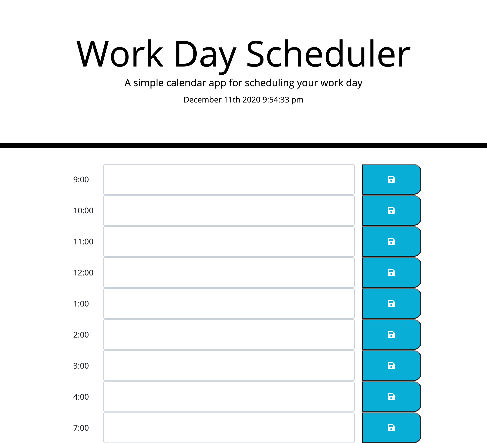

# Planner
This is a day planner that allows the user to save events by the hour in an average workday. The text content can then be saved in local storage by pressing the save icon. When the application is running correctly the colors of the input feild will change as time passes. Grey for time that has already passed, red for current hour, and green for hours remaining. 
